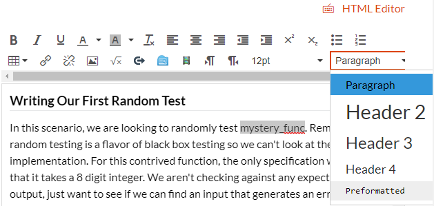
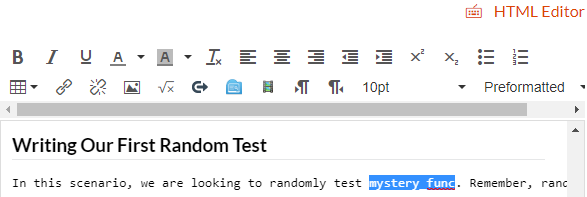
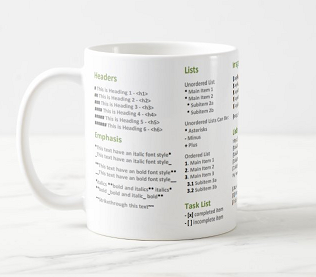

# Ecampus Markdown Workflow

My name is Eric Ianni and I would like to welcome you to my webinar on using Markdown to make course development easier on both you and Ecampus. This is the approach I developed to help me during my first course development assignment.

##  Webinar Learning Objectives (WLOs)

At the end of this webinar, attendees will be able to...

1. **Describe** how Markdown can be used to generate Canvas content
2. **Demonstrate** simple Markdown commands

# What is Markdown?

_Markdown_ is actually a mark**UP** language (think HTML and LaTeX). It was introduced in 2004 as a way to let people _easily_ write human readable content that could be easily converted into HTML. To demonstrate this readability let's look at a small example:

Content as shown in the browser:
#### Top Reasons to Develop a Course
1. You are **told**
2. You are experiencing a sense of _ennui_
3. ~~You don't have enough to do~~
___
The HTML used by the browser:

```HTML
<h4>Top Reasons to Develop a Course</h4>
<ol>
	<li>You are <strong>told</strong></li>
	<li>You are experiencing a sense of <em>ennui</em></li>
	<li><del>You don't have enough to do</del></li>
</ol>

```
___
Markdown used to produce the HTML:

```markdown
#### Top Reasons to Develop a Course
1. You are **told**
2. You are experiencing a sense of _ennui_
3. ~~You don't have enough to do~~

```

When reading raw HTML, a person needs to mentally discard all the tags. Markdown's "tags" are much more understated, thus not disrupting reading as much. Also, Markdown's syntax also is much more condensed, making it easier to write.

## Why use Markdown?

So what can Markdown do for us as course developers? Why would we want to use it instead of using Canvas directly or another word processor like Word?

### Rich Text Editors are the Worst

How many times have you wanted to include something as simple as a code snippet in your content only to be thwarted by the _Rich Text Editor_?

  
Suppose you want to make "mystery_func" in the following example into a code snippet. We highlight it and select preformatted.

  
Clearly this didn't work as we expected! The only solution Canvas offers is to use the _HTML Editor_, which is tedious and not the easiest if you are unfamiliar with HTML.

As we will see in a moment, Markdown can produce HTML that can be easily copied and pasted directly into Canvas! 

### Develop Content Like You Do Software

Many of us spend a large amount of time inside a code editor and in many ways it just feels _right_. Why give up that warm feeling of home to create our courses? Well with Markdown, you never have to leave your editor of choice!

### Come On, Everybody's Doing It!

For many of us, our primary experience with Markdown is in a GitHub `README.md`. But Markdown is gaining popularity in other sectors. Slack allows Markdown to be directly written in the standard message field. Even Piazza is getting into the Markdown game with their new post editor. Knowing how to use Markdown can really help with your messaging to the students.


## Common Markdown

Honestly, Markdown is a very small language and if you wanted, you could probably get it put onto a mug! 



We won't be going over all the Markdown commands here, but you can find a very detailed cheatsheet from [GitHub](https://github.com/adam-p/markdown-here/wiki/Markdown-Cheatsheet).
### Headers

Use a `#` to indicate a header. This equivelant to `<H1>` tags in HTML. To shrink the size of the header, just keep adding `#`'s! For example, `###` is the same as `<H3>`

### Text Emphasis

* _Italics_ are created using single underscores or astrisks. Both `_italics_` and `*italics*` render as _italics_.

* **Bold** is applied using double underscores or astrisks. Both `__bold__` and `**bold**` render as **bold**.

* Combining them gets a bit trickier, but can be done by combining underscores _and_ astrisks: `**This is bold and _this is bold italics_**` renders as  **This is bold and _this is bold italics_**.

### Images

Images are inserted using ``. The path to the image can be relative like `./images/mug.png` or a url. The picture of the mug above uses the following: ``.

### Code

Markdown has two ways of inserting code: inline and blocks.

* Inline: Use backticks (the one to the left of the 1 key) to surround the code snippet: `` `code snippet` `` renders as `code snippet`.

* Block: These are better suited for multiline code snippets. You can even designate syntax highlighting by specifying the language you are writing. To use, surround your code above and below with three backticks ` ``` `. If you want to specify a language, this goes immediately after the first three backticks.

````markdown
```python
def hello_world():
	print('Hello World')
```
````
```python
def hello_world():
	print('Hello World')
```

### HTML

Markdown allows for directly writing HTML code into the same document. This is very useful as Markdown, while useful, is missing some common things like underlining. To produce <u>this underlined statement</u> all I had to do was surround it with `<u></u>`.

It also makes it very easy to embed content from other pages. This includes things like YouTube videos, but more importantly for our purposes...

<!-- <iframe height="400px" width="100%" src="https://repl.it/@coeCS362/providinganswers?lite=true" scrolling="no" frameborder="no" allowtransparency="true" allowfullscreen="true" sandbox="allow-forms allow-pointer-lock allow-popups allow-same-origin allow-scripts allow-modals"></iframe> -->

## Writing Markdown

One of the best parts of writing Markdown is that you can do it in _any_ text editor! I am going to go over two methods I have personally tried.

### The Correct Way - Emacs

I have an addiction and that addiction is called _Emacs_. 


```lisp
(defun markdown-html (buffer)
  (princ (with-current-buffer buffer
    (format "<!DOCTYPE html><html><title>Impatient Markdown</title><xmp theme=\"united\" style=\"display:none;\"> %s  </xmp><script src=\"http://strapdownjs.com/v/0.2/strapdown.js\"></script></html>" (buffer-substring-no-properties (point-min) (point-max))))
	 (current-buffer)))

(defun markdown-preview-live ()
  (interactive)
  (impatient-mode 1)
  (setq imp-user-filter #'markdown-html)
  (cl-incf imp-last-state)
  (imp--notify-clients))
```
### The Less Correct Way - VS Code

# Enter GitHub
## GitHub Markdown
## GitHub Pages

# What about Ecampus?

## Trello

* Columns
* Labels
* Checklists
* URLs in the comments

## Be Kind to your ID

* Identify the name of your images next to your images
* Upload images directly to Canvas

## Things your ID can do to help

* Collapsable elements
* Importing into Canvas
* Make it look nice


